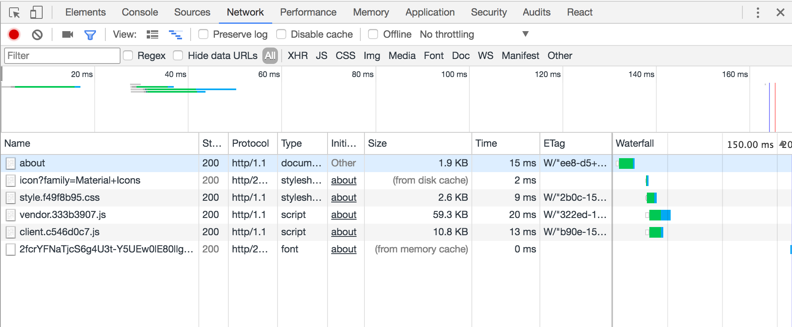
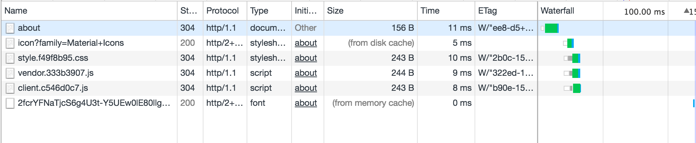

# React Starter [](https://travis-ci.org/richardkall/react-starter)

> Starter kit for creating universal React applications. React Toolbox feature forked from [richardkall/react-starter](https://github.com/richardkall/react-starter). A simple example of a universal app using the combination of React Toolbox, Webpack 2, and React Router 4.

## Features

- [x] [Babel](https://babeljs.io/)
- [x] [CSS Modules](https://github.com/css-modules/css-modules) + [cssnext](http://cssnext.io/)
- [x] [ESLint](http://eslint.org/)
- [x] [Express](http://expressjs.com/)
- [x] [React](http://facebook.github.io/react/)
- [x] [React Router v4](https://github.com/reactjs/react-router)
- [x] [React Toolbox](http://react-toolbox.com/)
- [x] [Redux](http://redux.js.org/)
- [x] [Webpack v2](https://webpack.github.io)

### Extras
- [x] [Apollo Client](http://dev.apollodata.com/) (separate branch: [feature/apollo](https://github.com/richardkall/react-starter/tree/feature/apollo))

## Setup

```bash
$ npm install
```

## Usage

Start development server:

```bash
$ npm run dev
```

Start production server:

```bash
$ NODE_ENV=production npm run build && npm start
```

## Production Build Browser Stats

On first page load:



On second page load:



## License

MIT © [Richard Käll](https://richardkall.se)
